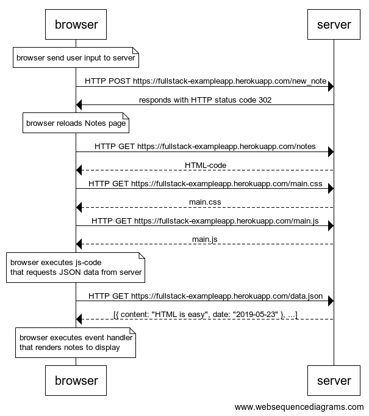
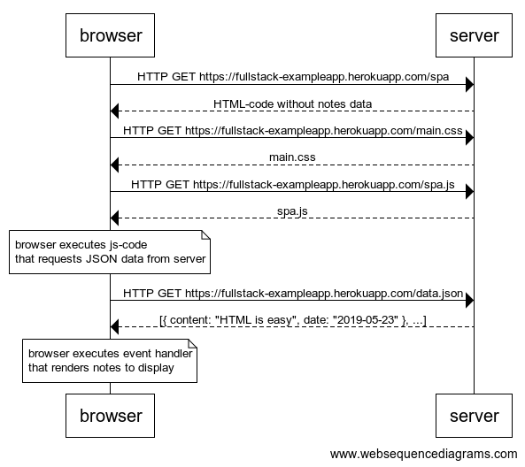
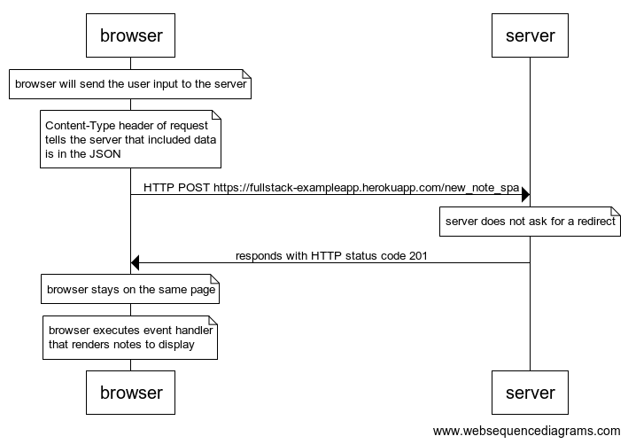

# Exercises 0.1.-0.6.

## 0.1: HTML
Review the basics of HTML by reading this tutorial from Mozilla: [HTML tutorial](https://developer.mozilla.org/en-US/docs/Learn/Getting_started_with_the_web/HTML_basics).

## 0.2: CSS
Review the basics of CSS by reading this tutorial from Mozilla: [CSS tutorial](https://developer.mozilla.org/en-US/docs/Learn/Getting_started_with_the_web/CSS_basics).

## 0.3: HTML forms
Learn about the basics of HTML forms by reading Mozilla's tutorial [Your first form](https://developer.mozilla.org/en-US/docs/Learn/HTML/Forms/Your_first_HTML_form).

## 0.4: New note

## 0.5: Single page app

## 0.6: New note
